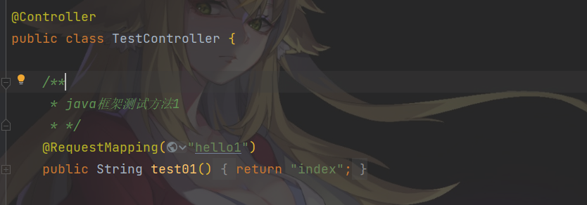
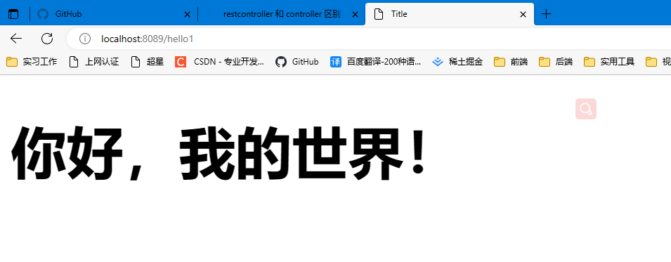
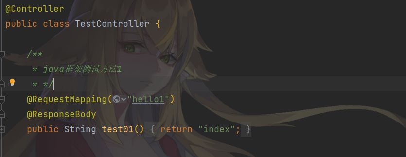
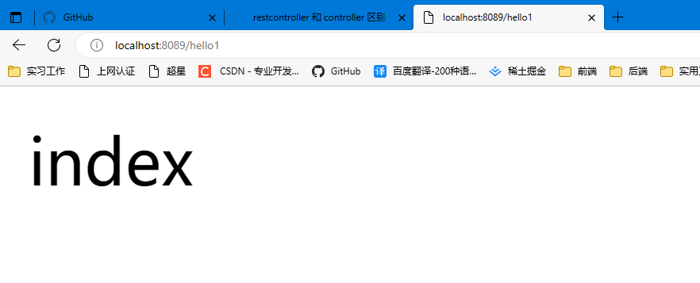
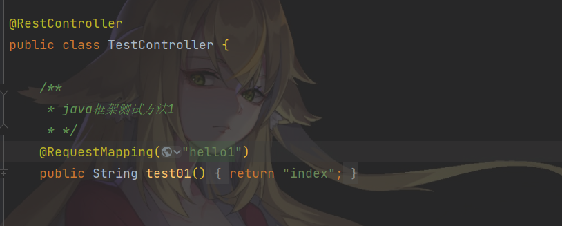
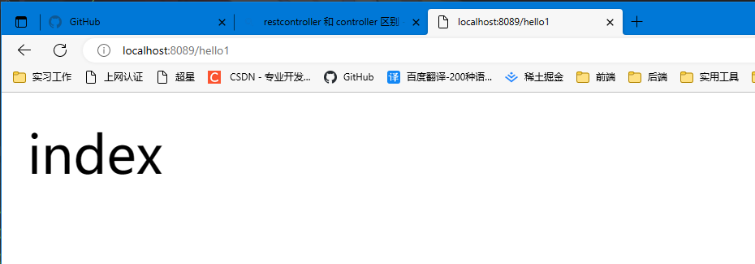

# ***\*RestController和Controller区别\****

## 一、概述

restcontroller和controller区别@RestController和@Controller的区别在于@RestController是Spring4之后加入的注解，它的作用相当于@Controller和@ResponseBody的结合体，可以直接返回JSON、XML等内容，而@Controller则需要在方法上添加@ResponseBody注解才能返回JSON等内容。

## 二、源代码

### 1. pom.xml

```xml
<?xml version="1.0" encoding="UTF-8"?>
<project xmlns="http://maven.apache.org/POM/4.0.0" xmlns:xsi="http://www.w3.org/2001/XMLSchema-instance"
         xsi:schemaLocation="http://maven.apache.org/POM/4.0.0 https://maven.apache.org/xsd/maven-4.0.0.xsd">
    <modelVersion>4.0.0</modelVersion>
    <parent>
        <groupId>org.springframework.boot</groupId>
        <artifactId>spring-boot-starter-parent</artifactId>
        <version>2.7.9</version>
        <relativePath/> <!-- lookup parent from repository -->
    </parent>
    <groupId>com.changjiang</groupId>
    <artifactId>score</artifactId>
    <version>0.0.1-SNAPSHOT</version>
    <name>score</name>
    <description>score</description>
    <properties>
        <java.version>1.8</java.version>
    </properties>
    <dependencies>
        <dependency>
            <groupId>org.springframework.boot</groupId>
            <artifactId>spring-boot-starter-web</artifactId>
        </dependency>
        <dependency>
            <groupId>org.springframework.boot</groupId>
            <artifactId>spring-boot-devtools</artifactId>
            <scope>runtime</scope>
            <optional>true</optional>
        </dependency>
        <dependency>
            <groupId>org.projectlombok</groupId>
            <artifactId>lombok</artifactId>
            <optional>true</optional>
        </dependency>
        <dependency>
            <groupId>org.projectlombok</groupId>
            <artifactId>lombok</artifactId>
            <version>1.18.20</version>
        </dependency>
        <dependency>
            <groupId>org.springframework.boot</groupId>
            <artifactId>spring-boot-starter-test</artifactId>
            <scope>test</scope>
        </dependency>
        <dependency>
            <groupId>org.apache.velocity</groupId>
            <artifactId>velocity-engine-core</artifactId>
            <version>2.2</version>
        </dependency>
        <dependency>
            <groupId>org.springframework.boot</groupId>
            <artifactId>spring-boot-starter</artifactId>
        </dependency>

        <!-- 引入thymeleaf的依赖-->
        <dependency>
            <groupId>org.thymeleaf</groupId>
            <artifactId>thymeleaf-spring5</artifactId>
            <version>3.0.13.RELEASE</version>
        </dependency>

    </dependencies>

    <build>
        <plugins>
            <plugin>
                <groupId>org.springframework.boot</groupId>
                <artifactId>spring-boot-maven-plugin</artifactId>
                <configuration>
                    <excludes>
                        <exclude>
                            <groupId>org.projectlombok</groupId>
                            <artifactId>lombok</artifactId>
                        </exclude>
                    </excludes>
                </configuration>
            </plugin>
        </plugins>
    </build>

</project>

```

### 2. 视图解析器

（1）springmvc.xml

```xml
<?xml version="1.0" encoding="UTF-8"?>
<beans xmlns="http://www.springframework.org/schema/beans"
       xmlns:xsi="http://www.w3.org/2001/XMLSchema-instance"
       xmlns:contex="http://www.springframework.org/schema/context"
       xmlns:mvc="http://www.springframework.org/schema/mvc"
       xsi:schemaLocation="http://www.springframework.org/schema/beans http://www.springframework.org/schema/beans/spring-beans.xsd http://www.springframework.org/schema/context https://www.springframework.org/schema/context/spring-context.xsd http://www.springframework.org/schema/mvc https://www.springframework.org/schema/mvc/spring-mvc.xsd">

    <!--扫描控制层组件-->
    <contex:component-scan base-package="com.changjiang.scorexxx"></contex:component-scan>

    <!--配置视图解析器-->
    <bean id="viewResolver"
          class="org.thymeleaf.spring5.view.ThymeleafViewResolver">
        <property name="order" value="1"/>
        <property name="characterEncoding" value="UTF-8"/>
        <property name="templateEngine">
            <bean class="org.thymeleaf.spring5.SpringTemplateEngine">
                <property name="templateResolver">
                    <bean
                            class="org.thymeleaf.spring5.templateresolver.SpringResourceTemplateResolver">
                        <!-- 视图前缀 -->
<!--                        <property name="prefix" value="/WEB-INF/templates/"/>-->
                        <property name="prefix" value="/resources/templates/"/>
                        <!-- 视图后缀 -->
                        <property name="suffix" value=".html"/>
                        <property name="templateMode" value="HTML5"/>
                        <property name="characterEncoding" value="UTF-8" />
                    </bean>
                </property>
            </bean>
        </property>
    </bean>

    <!--配置默认的servlet处理静态资源-->
    <mvc:default-servlet-handler/>

    <!--开启mvc的注解驱动-->
    <mvc:annotation-driven/>

    <!--视图控制器-->
    <mvc:view-controller path="/" view-name="index"></mvc:view-controller>

    <!--配置文件上传解析器-->
    <bean id="multipartResolver" class="org.springframework.web.multipart.commons.CommonsMultipartResolver"></bean>

    <bean class="org.springframework.web.servlet.handler.SimpleMappingExceptionResolver"></bean>
</beans>
```

（2）application.yml

```yml
#修改访问端口
server:
  port: 8089

#  视图解析器
spring:
  mvc:
    view:
      suffix: .html
      prefix: /templates/

```


### 3. 配置文件（application.yml）

```yml
server:
  port: 8089
```

### 4. 静态资源（index.html，hello2.html）

```html
<!DOCTYPE html>
<html lang="en" xmlns:th="http://www.thymeleaf.org">
<head>
    <meta charset="UTF-8">
    <title>Title</title>
</head>
<body>
<h1>你好，我的世界！</h1>
</body>
</html>
```

```html
<!DOCTYPE html>
<html lang="en" xmlns:th="http://www.thymeleaf.org">
<head>
    <meta charset="UTF-8">
    <title>Title</title>
</head>
<body>
<h1>你好，我的世界2！</h1>
</body>
</html>
```

### 5. 控制层（TestController.java）

```
package com.changjiang.scorexxx;

import org.springframework.web.bind.annotation.RequestMapping;
import org.springframework.web.bind.annotation.RestController;

//@Controller
@RestController
public class TestController {

    /**
     * java框架测试方法1
     * */
    @RequestMapping("hello1")
//    @ResponseBody
    public String test01(){
        return "index";
    }

    /**
     * java框架测试方法2
     * */
    @RequestMapping("hello2")
    public String test02(){
//        model.addAttribute("message", "你好，世界！");
        return "hello2";
    }
}
```

## 三、展示

### 1.  第1组

（Controller+RequestMapping）






### 2. 第2组

（Controller+RequestMapping+ResponseBody）





### 3. 第3组

（@RestController+RequestMapping）






