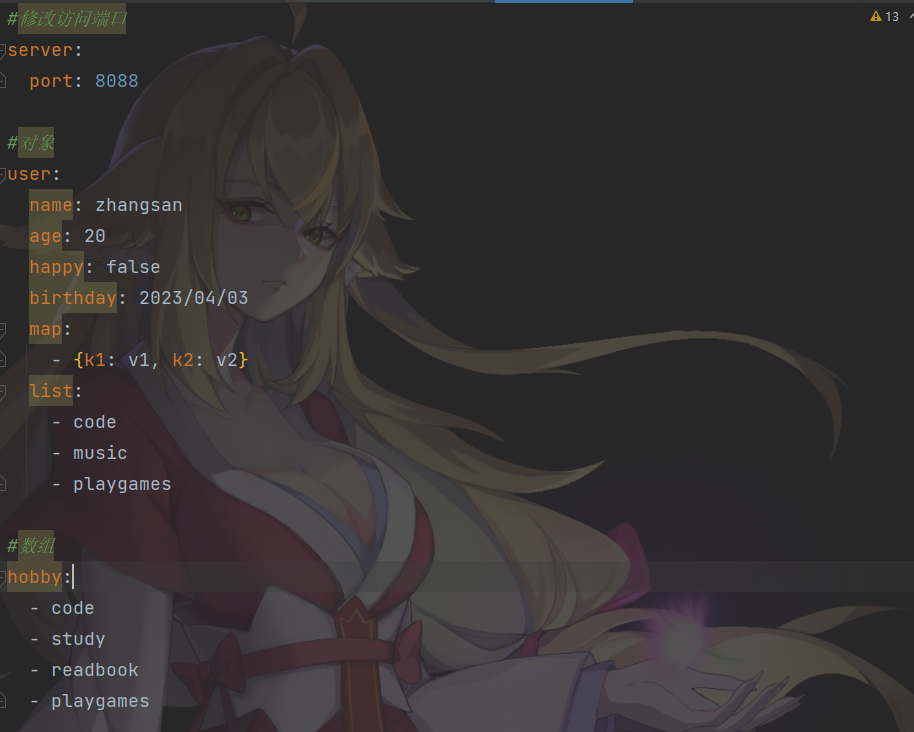
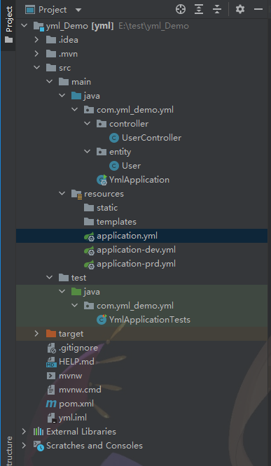
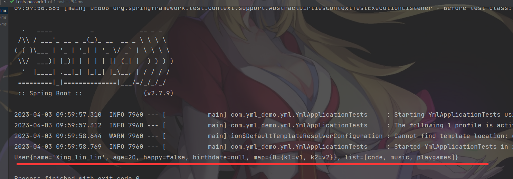

# 一、spring Boot层级结构

static：保存所有的静态资源：js css images；

templates：保存所有模板页面；（Spring Boot默认jar包使用嵌入式Tomcat，默认不支持JSP页面）；可以使用模版引擎（freemarker、thymeleaf）

application.properties：Spring Boot应用的配置文件

# 二、基本概念

Spring Boot使用一个全局的配置文件

application.properties

application.yml

 

配置文件放在src/main/resources目录或者类路径/config下

yml是YAML（YAML Ain't Markup Language）语言文件，以数据为中心，比json、xml等更加合适。

 

如下：

yml文件：

```yml
server:
  port: 8082
```


properties文件：

```yml
server.port=8081
```

YAML基本语法：

使用缩进表示层级关系；

缩进时不运行使用Tab，只允许使用空格。

和Python一样！

大小写敏感；

 

YAML支持三种数据结构：

对象：键值的集合

数组：一组按次序排列的值

字面量：单个的、不可再分的值

```yml
值的写法:
 
1>字面量：普通的值（数字，字符串，布尔）
k: v：字面直接来写；
 
字符串默认不用加上单引号或者双引号；
 
""：双引号；不会转义字符串里面的特殊字符；特殊字符会作为本身想表示的意思
 
name: "zhangsan \n lisi"：输出；zhangsan 换行 lisi
 
''：单引号；会转义特殊字符，特殊字符最终只是一个普通的字符串数据
 
name: ‘zhangsan \n lisi’：输出；zhangsan \n lisi
 
 
2>对象、Map（属性和值）（键值对）：
k: v：在下一行来写对象的属性和值的关系；注意缩进
 
对象还是k: v的方式
 
friends:
        lastName: zhangsan
        age: 20
行内写法：
 
friends: {lastName: zhangsan,age: 18}
 
 
3>数组（List、Set）：
用- 值表示数组中的一个元素
pets:
 - cat
 - dog
 - pig
行内写法
 
pets: [cat,dog,pig]
```

下面给出一个例子：


# 三、演示

如下目录结构：



User.java

```java
package com.yml_demo.yml.entity;

import org.springframework.boot.context.properties.ConfigurationProperties;
import org.springframework.stereotype.Component;

import java.util.Date;
import java.util.List;
import java.util.Map;

@Component/*注册成组件*/
@ConfigurationProperties(prefix = "user")
public class User {
    private String name;
    private Integer age;
    private Boolean happy;
    private Date birthdate;
    private Map<String, Object> map;
    private List<Object> list;

    public String getName() {
        return name;
    }

    public void setName(String name) {
        this.name = name;
    }

    public Integer getAge() {
        return age;
    }

    public void setAge(Integer age) {
        this.age = age;
    }

    public Boolean getHappy() {
        return happy;
    }

    public void setHappy(Boolean happy) {
        this.happy = happy;
    }

    public Date getBirthdate() {
        return birthdate;
    }

    public void setBirthdate(Date birthdate) {
        this.birthdate = birthdate;
    }

    public Map<String, Object> getMap() {
        return map;
    }

    public void setMap(Map<String, Object> map) {
        this.map = map;
    }

    public List<Object> getList() {
        return list;
    }

    public void setList(List<Object> list) {
        this.list = list;
    }

    @Override
    public String toString() {
        return "User{" +
                "name='" + name + '\'' +
                ", age=" + age +
                ", happy=" + happy +
                ", birthdate=" + birthdate +
                ", map=" + map +
                ", list=" + list +
                '}';
    }
}

```

application.yml

```yml
#修改访问端口
server:
  port: 8088

#对象
user:
  name: zhangsan
  age: 20
  happy: false
  birthday: 2023/04/03
  map:
    - {k1: v1, k2: v2}
  list:
    - code
    - music
    - playgames

#数组
hobby:
  - code
  - study
  - readbook
  - playgames

#微服务订单地址
url:
  orderUrl: http://localhost:3000

#当前要启用哪个配置文件
spring:
  profiles:
#    active: dev
    active: prd

```

UserController

```java
package com.yml_demo.yml.controller;

import org.springframework.beans.factory.annotation.Value;
import org.springframework.stereotype.Controller;
import org.springframework.web.bind.annotation.RequestMapping;

@Controller
public class UserController {
    @Value("${url.orderUrl}")
    private String url;

    @RequestMapping("test")
    public void test(){
        System.out.println(url);

    }
}

```

YmlApplicationTests.java

```java
package com.yml_demo.yml;

import com.yml_demo.yml.entity.User;
import org.junit.jupiter.api.Test;
import org.springframework.beans.factory.annotation.Autowired;
import org.springframework.boot.test.context.SpringBootTest;

@SpringBootTest
class YmlApplicationTests {

    @Autowired/*自动装配*/
    private User user;

    @Test
    void contextLoads() {
        System.out.println(user);
    }


}

```


# 四、运行截图如下

YmlApplicationTests.java

